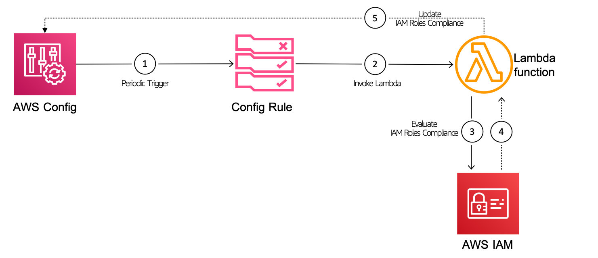

# Monitor unused IAM roles with AWS Config Custom Rules

 Identify inactive roles using `role last used` information using Lambda function and continuously monitoring role activity using AWS Config. You can extend this solution to push the `NON COMPLIANT` information to SNS and get the necessary teams involved in the clean up operation.

   

  Follow this article in **[Youtube](https://youtu.be/a4gOXBrVe6w)**

## Setup the custom rule

Make sure you have `AWS CLI` profile configured before executing below commands

```sh
dir_name="kon"
custom_rule_name="monitor_unused_iam_roles"

# If you dont have venv installed already
# pip install virtualenv
python3 -m venv ${dir_name}
cd ${dir_name}
source bin/activate
pip3 install rdk
# Configure AWS Profile
rdk init
# Lets create a LOCAL rule
rdk create ${custom_rule_name} --runtime python3.7 --resource-types AWS::IAM::Role

# Copy the file from `lambda_src` to the directory ${custom_rule_name} that was created now

# Deploy the custom rule
rdk deploy ${custom_rule_name}
```

### Resource Cleanup

Deleting all the resources created by the custom rule

```sh
rdk undeploy ${custom_rule_name}
```

### Buy me a coffee

Buy me a coffee ☕ here `https://paypal.me/valaxy`, _or_ You can reach out to get more details through [here](https://youtube.com/c/valaxytechnologies/about).

#### References

1. [Getting Started with Custom Rules](https://docs.aws.amazon.com/config/latest/developerguide/evaluate-config_develop-rules_getting-started.html)
1. [AWS Config Rule Development Kit](https://aws.amazon.com/blogs/mt/introducing-the-aws-config-rule-development-kit-rdk/)

### Metadata

**Level**: 200
